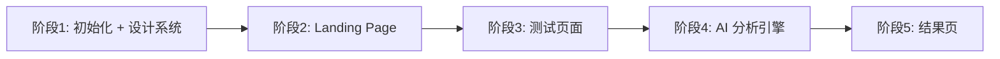

# Beauty Hue — MVP 实现计划

## 项目概述

基于 12 季型色彩理论的 AI 个人色彩诊断 Web 应用。用户上传照片 → 16 轮色彩对比评分 → AI 量化分析 → 输出主/次季型 + 适配色建议。

**核心体验关键词**：韩系温柔、高级感、克制、沉浸式、材质感

---

## User Review Required

> [!IMPORTANT]
> **技术栈确认**：计划使用 Vite + React + Tailwind CSS + Framer Motion。你的 UI 文档中提到了 Tailwind，请确认是否使用 **Tailwind v4**（最新）还是 **v3**？

> [!IMPORTANT]
> **AI 分析方案**：PRD 提到"AI 图像分析"，但同时要求"图片仅前端处理，不上传服务器"。计划采用 **纯前端 Canvas 像素采样 + 色彩学算法** 实现分析（无需后端 API），这样既满足隐私要求，又避免 API 成本。是否同意？

> [!IMPORTANT]
> **登录系统**：PRD 要求邮箱+密码登录。MVP 阶段是否需要真实后端？还是先用 **LocalStorage 模拟** + 占位 UI，后续再接真实 Auth？

> [!IMPORTANT]
> **牛皮纸纹理和相纸框**：你提供的图 2（牛皮纸）和图 3（相纸框）是否有高清原文件可用？还是需要我用 CSS/Canvas 模拟这些材质效果？

---

## 技术选型

| 层级 | 技术 | 理由 |
|------|------|------|
| 构建工具 | Vite | 极速 HMR，零配置 React 支持 |
| UI 框架 | React 19 | 复杂状态管理（16轮测试流程） |
| 样式 | Tailwind CSS | UI 文档明确要求 |
| 动画 | Framer Motion | 柔和过渡、卡片动效、页面转场 |
| 路由 | React Router v7 | Landing → Test → Result 三页导航 |
| 图片处理 | Canvas API | 前端像素采样、肤色提取、截图生成 |
| 图标 | Lucide React | 轻量、风格统一 |
| 字体 | Inter (Google Fonts) | 现代无衬线，匹配韩系设计感 |
| 存储 | LocalStorage / IndexedDB | 测试进度持久化、免登录体验 |

---

## 项目结构

```
e:/Beauty Hue/Anti-code/
├── public/
│   ├── textures/
│   │   ├── kraft-paper.webp          # 牛皮纸纹理背景
│   │   └── photo-frame.webp          # 相纸框素材
│   └── fonts/                        # 可选本地字体
├── src/
│   ├── assets/                       # 静态资源
│   ├── components/
│   │   ├── layout/
│   │   │   ├── Navbar.jsx            # 顶部导航（Beauty Hue logo + Login）
│   │   │   └── PageBackground.jsx    # 牛皮纸纹理背景容器
│   │   ├── landing/
│   │   │   ├── HeroSection.jsx       # 左侧文案区
│   │   │   ├── SeasonCard.jsx        # 单张季型玻璃卡片
│   │   │   └── CardCarousel.jsx      # 右侧卡片横向滑动区
│   │   ├── test/
│   │   │   ├── PhotoUploader.jsx     # 图片上传 + 裁剪
│   │   │   ├── PhotoFrame.jsx        # 相纸框容器（COLOR FOR YOU）
│   │   │   ├── ColorTestArea.jsx     # 颜色背景 + 用户头像渲染
│   │   │   ├── ControlPanel.jsx      # 右侧操作栏（评分按钮组）
│   │   │   ├── ProgressBar.jsx       # 进度条（5/16）
│   │   │   └── ScreenshotFlash.jsx   # 截图白闪效果
│   │   ├── result/
│   │   │   ├── SeasonResult.jsx      # 主/次季型展示
│   │   │   ├── ColorPalette.jsx      # 适合/不适合色卡
│   │   │   ├── AnalysisExplain.jsx   # AI 分析解释
│   │   │   ├── ScoreComparison.jsx   # 用户 vs AI 评分对比
│   │   │   └── ResultActions.jsx     # 保存/分享/再测按钮
│   │   └── ui/
│   │       ├── GlassButton.jsx       # 毛玻璃按钮（通用）
│   │       └── Modal.jsx             # 弹窗（登录/保存提示）
│   ├── data/
│   │   ├── seasonColors.js           # 12季型完整色彩数据库
│   │   ├── testSequence.js           # 16轮测试颜色序列
│   │   └── seasonDescriptions.js     # 季型描述文案
│   ├── engine/
│   │   ├── colorAnalyzer.js          # 核心：Canvas 像素采样 + 色彩分析
│   │   ├── skinExtractor.js          # 肤色/发色/瞳色自动提取
│   │   ├── seasonScorer.js           # 12季型评分引擎（五维评分）
│   │   └── resultGenerator.js        # 汇总生成最终结果
│   ├── hooks/
│   │   ├── useTestFlow.js            # 测试流程状态管理
│   │   └── useImageProcessor.js      # 图片处理 hooks
│   ├── pages/
│   │   ├── LandingPage.jsx           # 首页
│   │   ├── TestPage.jsx              # 测试页
│   │   └── ResultPage.jsx            # 结果页
│   ├── styles/
│   │   └── index.css                 # Tailwind 指令 + 全局样式 + 纹理
│   ├── App.jsx                       # 路由配置
│   └── main.jsx                      # 入口
├── index.html
├── tailwind.config.js
├── vite.config.js
└── package.json
```

---

## 阶段一：项目初始化 + 设计系统

### 1.1 项目脚手架

- `npx -y create-vite@latest ./` 初始化 React 项目
- 安装依赖：`tailwindcss`, `framer-motion`, `react-router-dom`, `lucide-react`
- 配置 Tailwind 自定义主题色

### 1.2 设计 Token 系统（tailwind.config.js）

```
colors:
  bone:      '#F1E4D1'   // 主背景
  navy:      '#162660'   // 按钮/强调
  sky:       '#D0E6FD'   // 辅助浅蓝
  text:      '#3A3A3A'   // 正文深灰
  muted:     '#8A8A8A'   // 辅助灰

borderRadius:
  card: '24px'
  button: '16px'

fontFamily:
  sans: ['Inter', 'system-ui', 'sans-serif']
```

### 1.3 全局样式（index.css）

- 牛皮纸纹理背景（CSS `background-image` 或 SVG noise filter）
- 毛玻璃按钮基础类
- 相纸框 CSS（不规则边缘 + 柔和阴影）
- 全局过渡动画曲线

### 1.4 视觉资产生成

- **牛皮纸纹理**：用 `generate_image` 生成无缝骨色牛皮纸纹理（参考图 2 的颗粒感）
- **12 张季型卡片封面**：为每个季型生成抽象渐变/色彩图（用于 Landing Page 卡片）

---

## 阶段二：Landing Page

参考你的图 1（布局参考）和图 4（ASCII 线框图）。

### 2.1 Navbar

```
┌─────────────────────────────────────────────┐
│  Beauty Hue (logo)                 [ Login ] │
└─────────────────────────────────────────────┘
```

- Logo：纯文字 `Beauty Hue`，大字号，`font-weight: 600`
- 右侧：Login 毛玻璃按钮
- 背景透明，不遮挡牛皮纸纹理

### 2.2 Hero Section（左侧文案区）

```
Discover Your
Perfect Colors

找到真正适合你的色彩

温柔描述文案 (1行)

[ Start Your Test ]   ← CTA 按钮（navy #162660 背景，白色文字）
```

- 标题：48-64px，`font-weight: 700`，颜色 `#162660`
- 中文副标题：24px，`#3A3A3A`
- 描述文案：16px，`#8A8A8A`
- CTA 按钮：圆角 16px，hover 微亮 + scale(1.02)
- 整体强留白，行距 1.6-1.8

### 2.3 Card Carousel（右侧卡片滑动区）

- **卡片尺寸**：340×420px, border-radius: 24px
- **玻璃拟态**：`backdrop-filter: blur(20px)`, `background: rgba(255,255,255,0.25)`, 轻阴影
- **卡片内容**：
  - 季型英文名（如 Cool Winter）
  - 季型中文名（如 冷冬型）
  - 抽象色彩渐变图（AI 生成）
- **交互**：
  - Hover：translateY(-8px) + scale(1.02) + blur 增强
  - 横向拖动滑动（Framer Motion `drag="x"`）
  - 自动缓慢轮播（requestAnimationFrame 实现平滑移动）
- **渐隐遮罩**：左右 `mask-image: linear-gradient(...)` 实现边缘渐隐
- **默认显示**：1 张完整 + 右侧露出 30%（暗示可滑动）

---

## 阶段三：测试页面

参考你的图 3（相纸框）和图 5（ASCII 线框图）。

### 3.1 上传模块（测试前）

- 居中上传区域（拖拽或点击上传）
- 提示文案：「建议使用自然光、素颜照片」
- 上传后：Canvas 裁剪为正方形，居中人脸
- 确认后进入测试流程（照片锁定不可更换）

### 3.2 相纸框容器（PhotoFrame）

基于图 3 的真实相纸框效果：

```
┌─────────────────────────┐  ← 米白色相纸，不规则边缘
│   COLOR FOR YOU          │
│   Original               │
│  ┌───────────────────┐   │
│  │                   │   │  ← 测试颜色区域（80% 面积）
│  │    ○ 用户头像      │   │
│  │   (圆形, 居中)     │   │
│  │                   │   │
│  └───────────────────┘   │
│                          │
└──────────────────────────┘
```

- 占屏幕 70-80% 宽度，75vh 高度
- 背景：偏白牛皮纸材质
- 边缘：CSS `clip-path` 或 SVG 模拟不规则裁切
- 阴影：`box-shadow: 0 10px 30px rgba(0,0,0,0.08)`
- 标题 "COLOR FOR YOU" + "Original" 在顶部

### 3.3 颜色测试区域

- 黑色区域内部填充当前测试颜色
- 切换动效：`transition: background-color 700ms ease-in-out`（灯光缓变感）
- 用户头像：圆形，居中，可通过滑杆缩放

### 3.4 右侧控制面板（ControlPanel）

```
[ 提交 ]        ← 需 ≥8 轮才可用
[ ─── ]         ← 分隔线
[ 色卡 ] Rose   ← 当前颜色名称 + HEX
[ 适合 ]        ← +1 分，hover 微暖色
[ 一般 ]        ← 0 分，hover 保持中性
[ 不适合 ]       ← -1 分，hover 极淡冷灰
[ ─── ]
[ 📸 截图 ]      ← 白闪 100ms + toast 提示
[ ← 上一轮 ]    ← 回退
```

- 纵向排列，右侧悬浮
- 毛玻璃按钮统一风格
- 点击评分 → 自动进入下一轮（带颜色过渡动画）
- 进度条：顶部显示 `5/16` + 细进度条

### 3.5 测试颜色策略

```javascript
// testSequence.js
阶段1（12轮）：12 季型极端代表色（每季型 1 色）
  - 明亮春 Bright Spring:  '#FF6B35'
  - 浅暖春 Light Spring:   '#FFD166'
  - 暖秋 Warm Autumn:      '#CB6D38'
  - 柔和秋 Soft Autumn:    '#A69076'
  - 深秋 Deep Autumn:      '#6B3A2A'
  - 冷冬 Cool Winter:      '#2B4C7E'
  - 深冬 Deep Winter:      '#1A1A2E'
  - 明亮冬 Bright Winter:  '#E91E63'
  - 浅夏 Light Summer:     '#B5C7D3'
  - 柔和夏 Soft Summer:    '#8E9AAF'
  - 冷夏 Cool Summer:      '#6B83A6'
  - 暖春 Warm Spring:      '#E8A87C'

阶段2（4轮）：根据阶段1评分，取 Top4 季型的日常色各 1 色
```

### 3.6 截图功能

- 使用 `html2canvas` 或原生 Canvas 捕获相纸框区域
- 白闪效果：全屏白色 overlay, opacity 0→1→0, 100ms
- Toast 提示 "截图已完成"
- 自动触发下载

---

## 阶段四：AI 分析引擎（纯前端）

### 4.1 肤色提取（skinExtractor.js）

```
上传照片 → Canvas 绘制 → 采样面部中心区域像素
→ 过滤非肤色像素（HSL 色相阈值）
→ 计算平均肤色 Lab 值
→ 提取明度(L)、冷暖倾向(a)、饱和度(C)
```

### 4.2 五维评分系统（seasonScorer.js）

每轮测试，对当前颜色 + 用户头像生成一个 `system_score`：

| 维度 | 说明 | 权重 |
|------|------|------|
| 明度匹配 | 肤色明度 vs 测试色明度的协调度 | 25% |
| 冷暖匹配 | 肤色冷暖 vs 测试色冷暖的协调度 | 30% |
| 饱和度匹配 | 肤色饱和度 vs 测试色饱和度适配 | 20% |
| 对比度和谐 | 肤色与测试色的对比度是否在舒适区 | 15% |
| 色相亲和 | 基于色彩学理论的色相关系 | 10% |

### 4.3 最终评分

```
final_score = user_score × 0.4 + system_score × 0.6

对 12 个季型排序 → 取 Top1 为主季型, Top2 为次季型
```

### 4.4 结果生成（resultGenerator.js）

- 主季型 + 次季型
- 适合色卡（该季型代表色 8-10 色）
- 不适合色卡（对立季型 4-6 色）
- 分析原因（基于五维得分差异生成解释文案）
- 用户评分 vs AI 评分差异可视化

---

## 阶段五：结果页

### 5.1 页面布局

```
┌──────────────────────────────────┐
│  牛皮纸纹理背景                    │
│                                  │
│  ┌────────────────────────────┐  │
│  │  🌸 你是「浅暖春」型          │  │
│  │  次季型：暖秋               │  │
│  │                            │  │
│  │  ── 分析原因 ──             │  │
│  │  你的肤色明度偏高...         │  │
│  │                            │  │
│  │  ── 适合的颜色 ──           │  │
│  │  [色卡] [色卡] [色卡] ...   │  │
│  │                            │  │
│  │  ── 避免的颜色 ──           │  │
│  │  [色卡] [色卡] ...          │  │
│  │                            │  │
│  │  ── 评分对比 ──             │  │
│  │  [雷达图/条形图]            │  │
│  │                            │  │
│  │  ── 截图回顾 ──             │  │
│  │  [缩略图] [缩略图] ...      │  │
│  │                            │  │
│  │  [ 保存结果 ] [ 再测一次 ]   │  │
│  └────────────────────────────┘  │
└──────────────────────────────────┘
```

### 5.2 保存结果

点击「保存结果」→ 弹窗：
1. **下载到本地**（默认）：生成结果卡片图片下载
2. **登录保存**：跳转登录流程（MVP 可为占位）

---

## 视觉资产清单

| 资产 | 来源 | 说明 |
|------|------|------|
| 牛皮纸纹理 | generate_image 或用户提供 | 无缝平铺，骨色 #F1E4D1 基调 |
| 相纸框 | CSS 模拟 + 用户图 3 参考 | 不规则边缘、"COLOR FOR YOU" 标题 |
| 12 张季型卡片封面 | generate_image | 抽象渐变/色彩图，每季型 1 张 |

---

## 开发顺序



**预估工作量**：每阶段约 1-2 个对话轮次完成

---

## Open Questions

> [!IMPORTANT]
> 1. **Tailwind 版本**：v3 还是 v4？（影响配置方式）
> 2. **AI 分析**：纯前端算法 vs 调用外部 AI API？纯前端方案无隐私风险且零成本。
> 3. **登录系统**：MVP 是否需要真实后端？建议先 LocalStorage 模拟。
> 4. **图片素材**：图 2 牛皮纸和图 3 相纸框是否有可直接使用的高清文件？还是需要我生成/模拟？
> 5. **结果页"截图回顾"**：是否展示用户在测试过程中手动截图的所有图片？

---

## Verification Plan

### 自动化测试
- `npm run dev` 启动后，使用 browser_subagent 逐页验证：
  - Landing Page：卡片滑动、CTA 跳转
  - 测试页：上传图片、16 轮评分流程、截图功能
  - 结果页：数据正确性、色卡渲染、下载功能

### 视觉验证
- 截图对比参考图，确保韩系高级感基调
- 验证牛皮纸纹理、相纸框、毛玻璃效果的还原度
- 检查所有动效是否"慢、柔、少"

### 性能验证
- 页面加载 < 2s
- 颜色切换 < 300ms
- 16 轮测试全流程 ≤ 2 分钟
